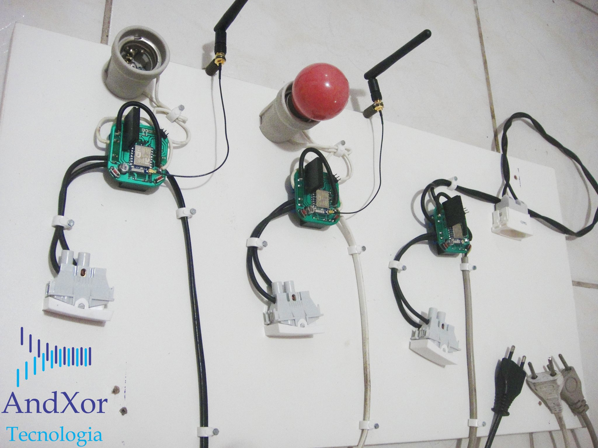
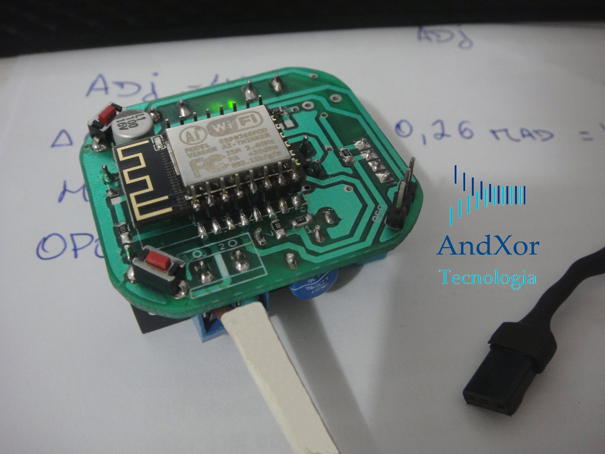

<!-- Headings -->
#<h1>Homefi AX</h1>

### The project started in 2014 was created with the intention of providing access to home automation to the average family income population.

The Homefi module was created to be easily installed by users with little knowledge in home electronics, requiring only the connection of little wires for the system to be installed. The Homefi project was cancelled around at 2016 after the launch of the Chinese module called Sonoff which basically does the same service that Homefo AX would do.(<a href="https://sonoff.tech/" rel="nofollow">www.sonoff.tech/</a>) 

### Hardware
<ul>
<li>ESP8266 2.4Ghz board from espressif;</li>
<li>Solid States Relays;</li>
<li>100 16v SMD Capacitors;</li>
<li>Hi-Link Imput 240Vac to 5Vdc/3w as Power Suply;</li>
<li>BC 846 Transistor;</li>
<li>DHT11 as Temperature Sensor;</li>
<li>Varistor and Inductor as protection of the circuit;</li>
<li>General conectors.;</li>
</ul>

### Protoypes Images

### Contact
<ul>
<li>
Yuri Lima
</li>
<li>
y.m.lima19@gmail.com
</li>
<li>
+353 83 419.1605
</li>
<li>
**Atention** If you go email me, please put as subject the name of the project, in this case: **(Homefi AX) Requests** 
</li>
</ul>

